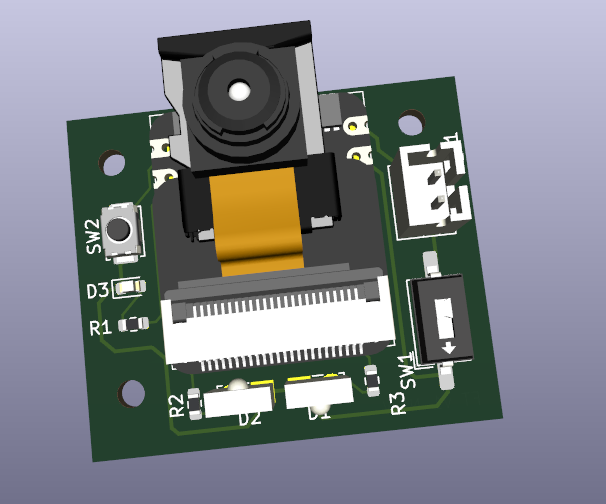
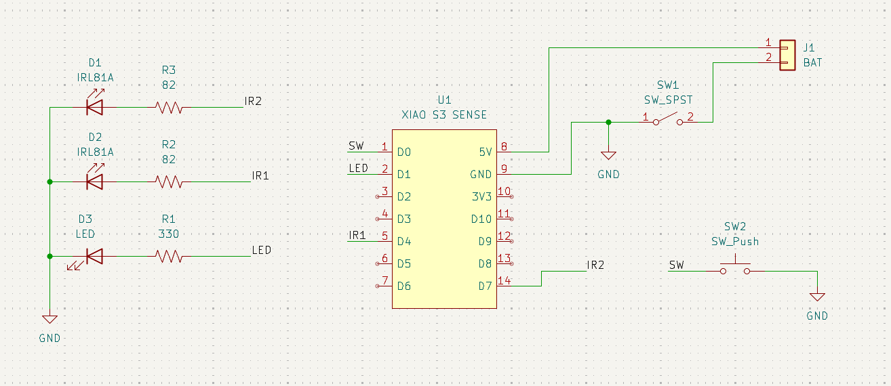
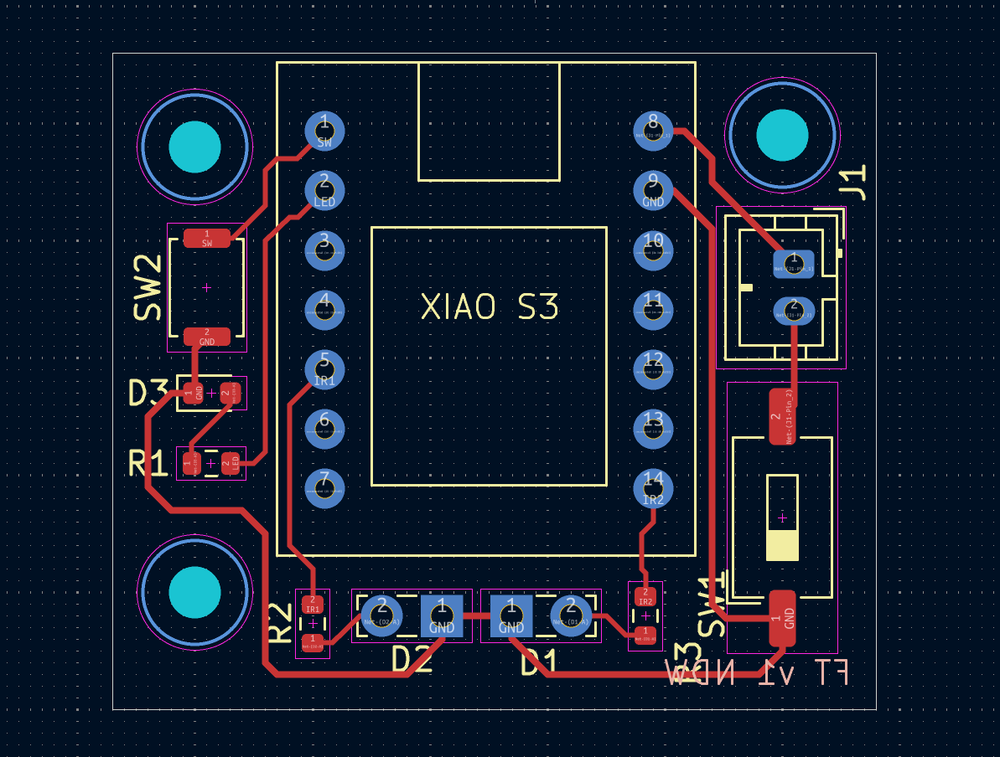

# lower-face-tracker-pb

Mounting PCB design for lower face tracking camera.

Intended for use with Project Babble software.

 

Uses XIAO ESP-32 S3 Sense module, 2x IR LEDs, a small LED, and a small button switch.

Currently untested, will likely swap out some LEDs if I continue, waiting to see if any official modules release for steam frame first.
